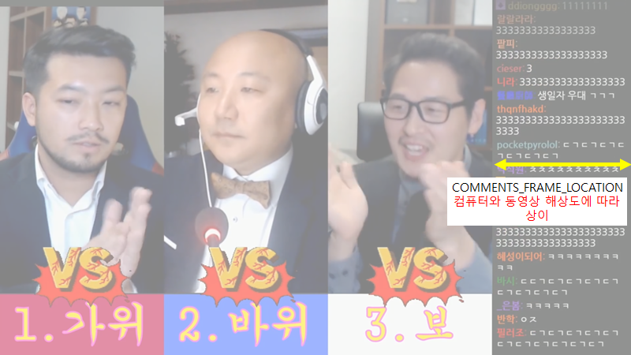

# Who is debate winner

침펄토론에서 '진짜' 승리자가 누구인지 확인하는 프로젝트입니다.

# 분석 결과

분석 결과는 다음과 같습니다. 단, 승복하면서 끝났거나 무승부가 된 판은 시청자 투표가 없었기 때문에 분석 결과가 없습니다.

|     동영상 이름     | 당시 집계/결과         | 예상 퍼센트 |      분석 결과      |        실제 퍼센트        |
| :------------------: | :--------------------- | :---------: | :-----------------: | :------------------------: |
|   크리링 대 천진반   | 주호민 승(침착맨 승복) |            |                    |                            |
|     딱복 대 물복     | 침착맨 승              |            | **주호민 승** |          81 대 16          |
|     인어 대 어인     | 주호민 승              |  54 대 46  |      주호민 승      |          62 대 38          |
|     유비 대 조조     | 침착맨 승(주호민 승복) |            |                    |                            |
|   침착맨 대 주호민   | 무승부(합의)           |            |                    |                            |
|     여름 대 겨울     | 주호민 승(침착맨 승복) |            |                    |                            |
|    사자 대 호랑이    | 주호민 승(침착맨 승복) |            |                    |                            |
|     단팥 대 야채     | 주호민 승              |            |      주호민 승      |          65 대 35          |
| 용의 꼬 대 뱀의 머리 | 침착맨 승              |  52 대 48  | **주호민 승** |          53 대 47          |
|  가위 대 바위 대 보  | 김풍 승                |            |       김풍 승       | 42(풍) 대 38(펄) 대 20(침) |

기존 침착맨 총 3회(시청자 투표 2회, 주호민 승복 1회) 우승, 주호민 총 5회(시청자 투표 2회, 침착맨 승복 3회) 우승, 김풍 총 1회(시청자 투표 1회) 우승, 무승부 1회(합의 1회)의 결과에서
침착맨 총 __1회__(시청자 투표 __우승 없음__, 주호민 승복 1회) 우승, 주호민 총 __8회__(시청자 투표 __4회__, 침착맨 승복 3회) 우승, 김풍 총 1회(시청자 투표 1회) 우승, 무승부 1회(합의 1회)로 변경되었습니다.

특히 당시 부정 집계가 있었던 물복 대 딱복은 무려 61%p차로 주호민이 승리하였던 것을 확인할 수 있었습니다.

하지만 박빙이었던 2번의 승부(용의 머리 대 뱀의 머리(6%p 차로 주호민 승리), 가위 대 바위 대 보(4%p 차로 김풍 승리))는 오차 범위 이내로도 볼 수 있어서 확언하기는 어렵습니다.

# 사용법

이 파트는 직접 프로그램을 돌려 보고 싶은 경우 프로그램을 사용하는 방법을 서술하는 파트입니다. 분석 결과가 궁금하시다면 위의 분석 결과 탭을 확인해주세요.

이 프로그램은 Colab용으로 제작된 프로그램이 아닙니다. 만약 Colab에서 사용하시려면 몇 가지 변경을 가해야 할 수 있습니다.
이 프로그램은 테스트 환경은 Windows 11, Python 3.11.4입니다. 기타 시스템에서 작동을 보장하지 않습니다.

1. requirements.txt 파일에 있는 모든 라이브러리를 설치하세요.
2. 침펄토론 영상을 videos 폴더에 넣으세요.
3. `find_winner.ipynb`으로 가면 원하는 영상의 영상 정보를 주석 해제하세요. 정보를 직접 커스텀해도 좋습니다.
   기본 정보는 1080p 60fps으로 맞추어져 있습니다. 1920x1080이 아니라면 동작하지 않고, 60fps가 아니라면 `FRAME_RANGE`를 수정해야 합니다.
4. 모든 코드를 돌리세요.

## `영상 정보` 설명

`영상 정보`는 다음과 같이 구성되어 있습니다.

* `VIDEO_NAME`: 동영상 파일의 이름입니다. 기본적으론 간단한 영어 이름으로 구성되어 있습니다. 동영상 파일의 이름은 이 프로젝트에서 기본적으로 사용한 영상 이름 그대로 사용하는 것을 추천합니다.
* `FRAME_RANGE`: 동영상에서 투표가 있었던 구간입니다. 50프레임 당 한 번 캡처하는 것으로 설정되어 있지만 개인 선호에 따라 변경할 수 있습니다.
  60fps가 아니라면 직접 몇 번째 프레임부터 몇 번째 프레임까지인지를 직접 확인해야 합니다.
* `COMMENTS_FRAME_LOCATION`: 댓글 창이 화면 왼쪽에서 몇 픽셀 떨어져 있는지에 대한 자료입니다. 아래의 그림을 참고해 주세요.
  
* `ORIGINAL_RESULTS`: 당시 '슈퍼 컴퓨터'의 결과를 의미합니다. '침착맨', '주호민', '김풍' 중에 하나로 고르시면 됩니다.

# 작동 방식

`who-is-debate-winner`는 다음과 같이 작동합니다.

1. 사용자가 직접 입력한 영상 정보를 불러옵니다.
2. `chatting-images` 폴더에 영상 이름과 동일한 이름의 폴더를 만듭니다.
3. `video` 폴더에 있는 영상을 불러와 `FRAME_RANGE` 동안 영상의 댓글을 크롭해 `chatting-images/<영상 이름>`폴더에 보관합니다. 단, 이때 이전 프레임과 동일한 채팅이라면 저장하지 않습니다.
4. `easyocr`로 폴더 내 모든 이미지의 문자를 분석합니다.
5. 특정한 로직을 통해 이미지의 문자로부터 실제 투표수를 추출합니다.
6. `easyocr`로 분석한 모든 문자와 실제 투표수를 `chatting-ocr-results/<영상 이름>.json`에 저장합니다.
7. 요약된 결과를 `results.txt`에 저장합니다.

이때 실제 투표수를 추출하는 알고리즘은 다음과 같습니다.

1. ocr 결과를 불러옵니다.
2. 한 행에 있는 문자열에서 가장 많은 문자(1, 2(침펄의 경우) 또는 1, 2, 3(침펄풍의 경우) 중에서)를 찾습니다.
   한 행에 있는 문자 개수가 동일하며나 문자가 없다면 패스합니다.
3. 만약 전 행의 가장 많은 문자와 이번 행의 가장 많은 문자가 일치한다면 패스하고, 아니라면 투표 결과에 추가합니다.
   전 행의 가장 많은 문자와 이번 행의 가장 많은 문자가 일치한다면 패스하는 이유는, 2222(나뉘어짐)2222일 경우 중복 계산될 수 있기 때문입니다. 다만 이 경우 이름으로 분리가 되지 않을 경우 두 표가 합쳐질 수 있다는 단점이 있습니다.

이를테면 다음과 같습니다. (실제 데이터의 일부입니다.)

```python
 ['222222222222222222',  # 2
  'Ehokalisimakilme',  # None(투표 결과 없음)
  '2222222222222222222222',  # 2
  '222222222',  # 스킵됨(전 행의 가장 많은 문자와 이번 행의 가장 많은 문자가 일치함)
  '2018',  # None
  '내공은극락왕생:',  # None
  '2222222222222222222222',  # 2
  '222222222222222',  # 스킵됨
  '파파라미:',  # None
  '333333333333333',  # 3
  '마카프로조현수:',  # None
  '-111111111111111',  # 1
  '리정대:',  # None
  '3333333333333333333333',  # 3
  '333333333',  # 스킵됨
  '텍설: 가위바위보로 합시다',  # None
  '피에프센스:',  # None
  '1111111111111111111111',  # 1
  '11111',  # 스킵됨
  'yeonogigkr:',  # None
  '33333333333333333333',  # 3
  '까르로끼공:',  # None
  '333333333333333333',  # 3
  'minininjal2:',
  '2222222222222222222222',  # 2
  '222',  # 스킵됨
  '무레한인간: 333',  # 3
  'gljhan:',  # None
  '3333333333333333333333',  # 3
  '333333333333']  # 스킵됨
```

# 한계

이 분석 결과는 한계가 있습니다.

* 한 사용자가 중복 투표를 했을 경우
* 단순히 숫자를 언급했거나 사용자 이름에 숫자가 들어갔을 경우 (투표가 아님)
  (e.g. user35**2**91: 그래도 **2**가 많지 않냐 ㅋㅋ)
* OCR이 제대로 작동하지 않았을 경우

이 때문에 이 투표를 '절대적'으로 보는 것은 그리 현명하지 않습니다. 하지만 위와 같은 불확실성은 1과 2, 3이 모두 가지고 있기 때문에 '편향된' 결과가 나올 확률은 비교적 적습니다. 따라서 투표 결과를 상대적으로 비교하는 것은 비교적 신뢰할 수 있습니다.
